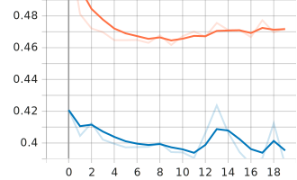
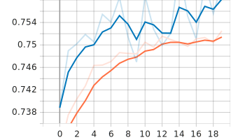

# YamNet transfer learning
Based on: [ Kaggle dataset ](https://www.kaggle.com/datasets/soumendraprasad/musical-instruments-sound-dataset)
## Let the results speak


### accuracy 73%
precision|  recall |  f1-score |   support
-- |  -- |  --- |   ---
  Sound_Drum     |  0.80  |   0.79   |   0.80   |    900
  Sound_Guitar  |   0.94    |  0.67    |  0.78     | 1619
  Sound_Piano     | 0.68   |   0.93      0.78    |  1139
  Sound_Violin   |  0.09  |    0.11   |   0.10   |    307
macro avg     |  0.63   |   0.62   |   0.61    |  3965
weighted avg     |  0.77    |  0.73    |  0.73   |   3965
<table style="text-align: center">
  <tr>
    <td><b>epoch loss</b></td>
     <td><b>categorical accuracy</b></td>
  </tr>
  <tr>
    <td valign="top">  </td>
    <td valign="top">   </td>
  </tr>
</table>

------
### About Dataset
The Musical Instruments Sound Dataset on Kaggle contains over 3,000 audio samples of notes from 11 musical instruments, recorded at a 16-bit/44.1 kHz sampling rate. The 2-4 second WAV format clips are labeled with the instrument class and split into training and test subsets. This collection can be used to develop and evaluate machine learning models for automatic musical instrument recognition.

------
## Project Description
Transfer Learning on [YamNet](https://tfhub.dev/google/YamNet/1)

What is YamNet?
---
> YamNet is a Convolutional neural network that is specifically designed for audio classification. It is
based on the MobileNetV1 architecture, which is a lightweight and efficient architecture that is well-
suited for mobile devices. YamNet uses a mel-spectrogram as input, which is a representation of the
audio signal that is frequency-aware. The mel-spectrogram is then passed through the YamNet
network, which outputs a 1024-dimensional embedding.

### classifier Architecture

```python
my_model = Sequential([
# Dense(1024, activation='relu',),
keras.layers.Dense(128, input_shape=(1024,), activation="relu", kernel_regularizer=keras.regulari
keras.layers.Dropout(0.2),
Dense(4, activation='softmax'),
])
```

## Big twist

I used YamNet embedding to simplify task and just train the classifier layers and my whole computations and train time drop reduced by 87%